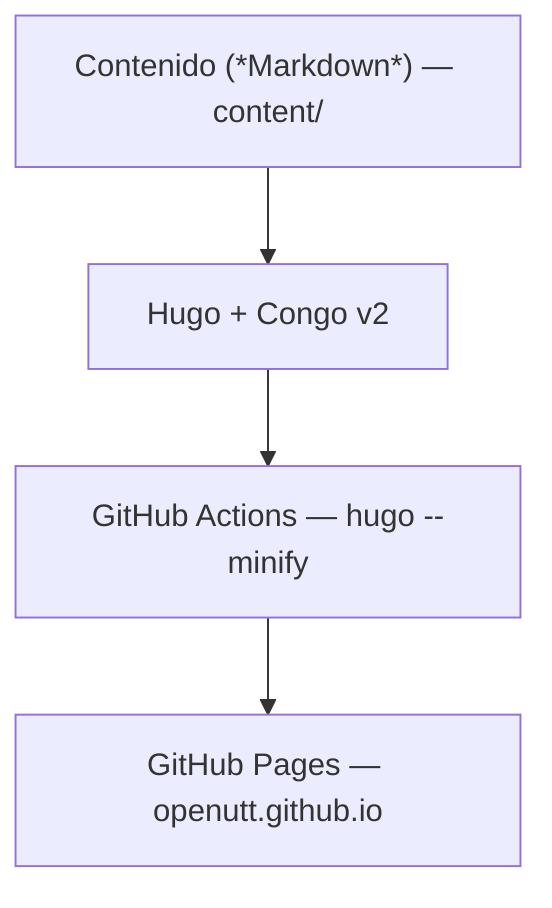

[](https://openutt.github.io/) [](LICENSE)

**OpenUTT** es una iniciativa estudiantil de la UTT para que los proyectos cuatrimestrales de TI **tengan continuidad entre generaciones**: cuando un proyecto se abandona, no se pierde — se preserva (código, idea, planeación y diseño) para que otra generación lo retome, un docente lo use como ejemplo, o cualquiera lo estudie y aprenda de él.
Este repositorio es su **sitio web**: el portal donde se publica la propuesta, la investigación sobre open source y el **índice de proyectos** de estudiantes.

## La iniciativa

- **El problema**: cada cuatrimestre se desarrollan proyectos de TI valiosos que, al terminar el curso, se abandonan y se pierden. La siguiente generación empieza de cero.
- **La metodología**: adoptar las prácticas de la comunidad open source (README, licencias, issues, pull requests) como forma de trabajo — no como una materia nueva, sino como la manera de hacer que los proyectos sobrevivan al cuatrimestre.
- **El alcance**: los proyectos de estudiantes **no se mueven de sus cuentas**; el índice los enlaza y les da visibilidad. Los proyectos que la UTT use de verdad, o que tengan más de un mantenedor activo, pueden pasar a la [organización OpenUTT](https://github.com/openutt). El criterio completo está en el [Plan de repositorio](https://openutt.github.io/propuesta/repositorio/).
- **La autoría se respeta**: quien escribe el código es su autor, y publicarlo no regala la propiedad. Cada proyecto elige su licencia; la estándar de la iniciativa es **MIT**.
- **Participar es voluntario**: nadie está obligado, y no participar no excluye de los beneficios.
La propuesta completa (problema, objetivo y justificación) está en **[openutt.github.io/propuesta](https://openutt.github.io/propuesta/)**.

## Qué hay en el sitio

| Sección | Qué es |
| --- | --- |
| [Propuesta](https://openutt.github.io/propuesta/) | La propuesta formal de la iniciativa |
| [Conceptos](https://openutt.github.io/conceptos/) | Investigación publicada: open source vs. software libre, licencias, OSI… |
| [Proyectos](https://openutt.github.io/proyectos/) | El índice de proyectos estudiantiles y su estado (*activo / abandonado / completado*) |
| [Agregar un proyecto](https://openutt.github.io/agregar-proyecto/) | El proceso para sumar tu proyecto al índice |
| [Plan de repositorio](https://openutt.github.io/propuesta/repositorio/) | Cómo se organizan los repositorios: organización, índice y portal |

## Sumar tu proyecto

¿Tienes un proyecto cuatrimestral (terminado, en curso o abandonado)? El índice es abierto y tu código se queda donde está: solo se enlaza.
1. Sigue el proceso en **[Agregar un proyecto](https://openutt.github.io/agregar-proyecto/)** — es un pull request a este repositorio.
2. Tu repositorio debe cumplir el mínimo: **README** (qué es y cómo levantarlo), **LICENSE** definida, **`.gitignore`** sin claves y **sin secretos en el historial**.

## Contribuir al sitio

¿Encontraste un error, quieres mejorar un texto o tocar el diseño? Lee **[CONTRIBUTING.md](CONTRIBUTING.md)** (requisitos, flujo de PR y convenciones), y para entradas del índice basta con seguir [Agregar un proyecto](https://openutt.github.io/agregar-proyecto/).

## El sitio por dentro

Sitio estático: **Hugo** (extended) + tema **Congo v2** como módulo de Go, construido por **GitHub Actions** y publicado en **GitHub Pages**.



| Pieza | Rol |
| --- | --- |
| [Hugo](https://gohugo.io) (extended) | Generador de sitio estático: convierte `content/` (Markdown) en HTML, CSS y JS |
| [Congo v2](https://jpanther.github.io/congo/) | Tema del sitio, cargado como módulo Go (`go.mod`) |
| GitHub Actions | CI/CD: en cada push a `main` corre [`.github/workflows/hugo.yaml`](.github/workflows/hugo.yaml) |
| GitHub Pages | Hosting gratuito: publica el resultado en `https://openutt.github.io/` |

<details>
<summary>¿Qué es Hugo y por qué un sitio estático?</summary>
Hugo es un generador de sitios estáticos escrito en Go y de código abierto. Procesa el contenido **una sola vez**: toma archivos Markdown, les aplica una plantilla (el tema) y produce HTML puro — rápido de cargar y barato de mantener, sin base de datos ni servidor. El contenido vive como archivos versionados con Git, editables por cualquiera, y el despliegue es automático y sin costo.
Documentación: [Hugo](https://gohugo.io/getting-started/) · [Congo](https://jpanther.github.io/congo/docs/getting-started/) · [Congo + GitHub Pages](https://jpanther.github.io/congo/docs/hosting-deployment/#github-pages)
</details>

### Desarrollo local

Requisitos: [Hugo **extended** ≥ 0.158](https://gohugo.io/installation/) y [Go](https://go.dev/) (el tema se carga como módulo).
```bash
hugo server          # dev en http://localhost:1313 con recarga en vivo
hugo --gc --minify   # build limpio antes de publicar (el CI corre hugo --minify)
```

### Estructura del repositorio

```
config/_default/        Configuración del sitio y del tema (hugo.toml, params.toml…)
content/                Contenido en Markdown
├── propuesta/          La propuesta y el plan de repositorio (en /propuesta/repositorio/)
├── conceptos/          Investigación publicada
├── proyectos/          Índice: una carpeta por proyecto (index.md + imágenes) y PLANTILLA/
├── agregar-proyecto/   Página de proceso
└── _index.md           Portada
layouts/shortcodes/     Shortcodes propios (pinned, wide-image, proyecto-meta)
assets/                 CSS e imágenes del sitio
static/                 Favicons, manifiesto y archivos estáticos
archetypes/             Plantillas para `hugo new`
.github/                Workflow de deploy y plantillas de pull request
public/, resources/     Generados por Hugo (ignorados por Git: no se editan)
```

## Licencia

[MIT](LICENSE). Cada proyecto del índice puede elegir su propia licencia.
