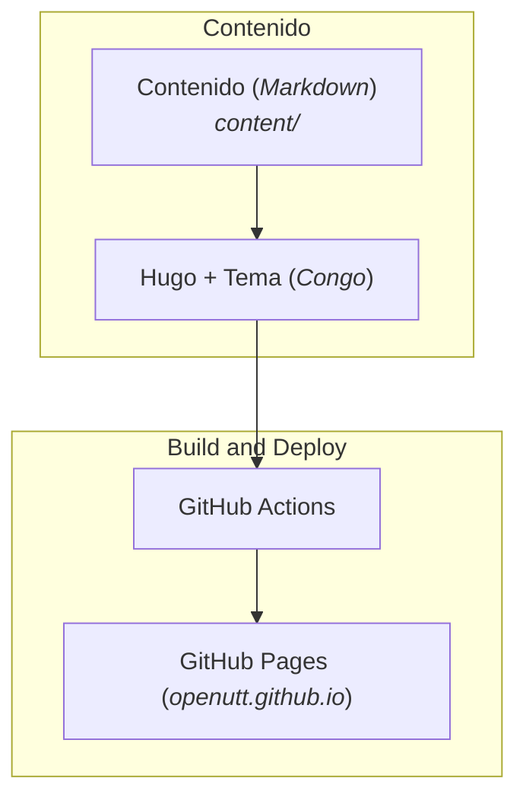

[](https://openutt.github.io/)

Sitio web de **OpenUTT**, una iniciativa para que los proyectos cuatrimestrales de TI de la UTT tengan **continuidad entre generaciones**, basándose en las prácticas de la comunidad Open Source: cuando un proyecto se abandona, no se pierde — se preserva (código, idea, planeación y diseño) para que otra generación lo retome, un docente lo use como ejemplo, o cualquiera lo estudie y aprenda de él.

## ¿Qué es esta web?

Esta página sirve dos propósitos:

1. **Describir la iniciativa y publicar posts sobre ella.** Aquí se documenta la propuesta completa (problema, objetivo, justificación y filosofía) en la sección [Propuesta](content/propuesta/), y se publican los conceptos investigados sobre Open Source y software libre en [Conceptos](content/conceptos/).

2. **Índice de proyectos estudiantiles (próximamente).** En el futuro, la web actuará como **catálogo público** de los proyectos que equipos y estudiantes quieran sumar a la iniciativa: se enlazarán a sus repositorios **sin moverlos** de sus cuentas, dándoles visibilidad y preservando los proyectos abandonados como referencia para reutilizarlos. El plan está detallado en [Plan de repositorio](content/propuesta/repositorio.md).

## Arquitectura

La web es un **sitio estático** construido con tres piezas:



| Componente | Rol |
|---|---|
| **[Hugo](https://gohugo.io)** | Generador de sitios estáticos. Convierte el contenido escrito en Markdown (`content/`) en archivos HTML, CSS y JS listos para publicar. Se requiere la versión **extended** (ver `config/_default/config.toml`). |
| **[Congo v2](https://jpanther.github.io/congo/)** | Tema de Hugo cargado como módulo (`github.com/jpanther/congo/v2 v2.14.0`, ver `go.mod`). Aporta el diseño, la navegación y las funciones del sitio. Configuración en `config/_default/`. |
| **[GitHub Pages](https://docs.github.com/es/pages)** | Hosting gratuito donde se publica el sitio en `https://openutt.github.io/`. |
| **GitHub Actions** | CI/CD. El workflow [`.github/workflows/hugo.yaml`](.github/workflows/hugo.yaml) se ejecuta al hacer push a `main`: instala Hugo, ejecuta `hugo --minify` y publica la carpeta `public/` en la rama `gh-pages`. |

Documentación de referencia:

- [Documentación de Hugo](https://gohugo.io/getting-started//)
- [Guía de inicio de Congo](https://jpanther.github.io/congo/docs/getting-started/)
- [Configuración de Congo](https://jpanther.github.io/congo/docs/configuration/)
- [Documentación de GitHub + Hugo](https://jpanther.github.io/congo/docs/hosting-deployment/#github-pages)

## ¿Qué es Hugo?

[Hugo](https://gohugo.io) es un **generador de sitios web estáticos** escrito en Go y de **código abierto**. En lugar de manejar contenido y pedir páginas a una base de datos en cada visita, Hugo procesa todo **una sola vez**: toma archivos de texto plano (normalmente en Markdown), les aplica una plantilla (tema) y produce un sitio de HTML puro, muy **rápido de cargar** y **barato de mantener**.

Sus ventajas principales:

- **Rápido:** genera sitios completos en milisegundos, incluso con miles de páginas.
- **Sin base de datos ni servidor:** el resultado son archivos estáticos que cualquier hosting puede servir.
- **Control de versiones:** el contenido vive como archivos Markdown, fácil de versionar con Git y de editar en cualquier editor.
- **Temas y comunidad:** un gran ecosistema de temas (como Congo) y plantillas para empezar en minutos.

Por eso es ideal para esta iniciativa: el contenido lo escribe cualquiera con Markdown, se versiona en el propio repositorio de GitHub y el despliegue es automático y sin costo.

## Estructura del repositorio

```
config/_default/      Configuración del sitio y del tema
content/              Contenido en Markdown (home, propuesta, conceptos)
layouts/              Shortcodes y plantillas propias
static/               Archivos estáticos (imágenes, logos)
.github/workflows/    CI/CD para construir y desplegar
public/               Salida generada por Hugo (no se edita a mano)
```

## Publicar cambios

1. **Desarrollo local:** `hugo server` — sirve el sitio en `http://localhost:1313` con recarga en vivo.
2. **Publicar:** haz push a la rama `main`. GitHub Actions construye el sitio y despliega en GitHub Pages automáticamente.

## Licencia

[MIT](LICENSE)
