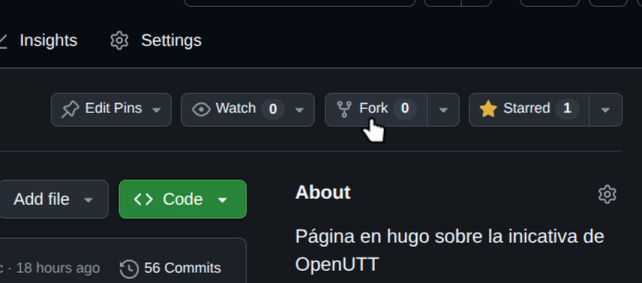
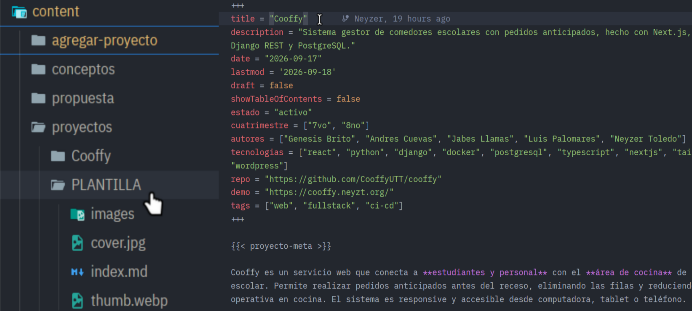
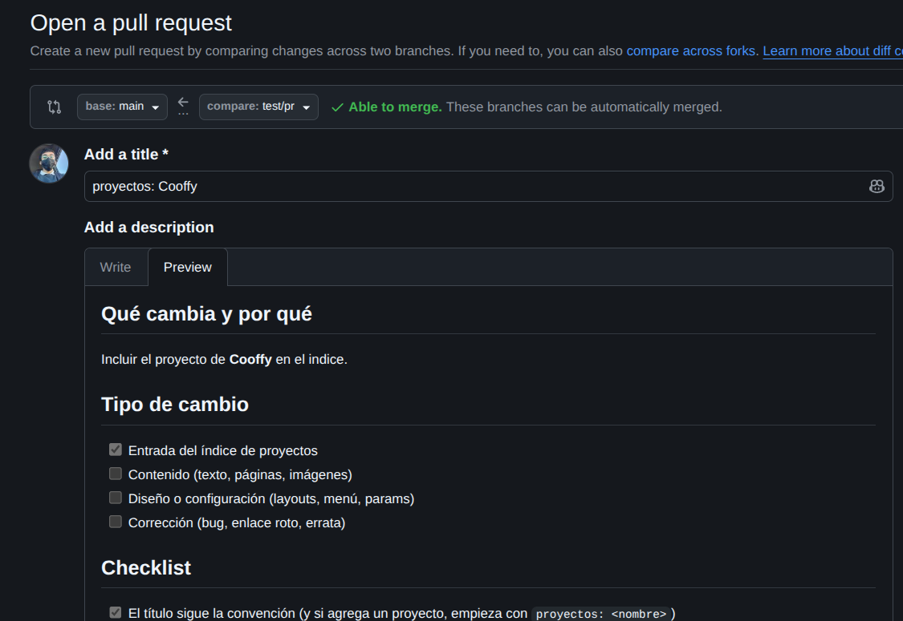

+++
title = 'Como agregar un proyecto'
description = 'Cómo sumar tu proyecto cuatrimestral al índice de OpenUTT.'
date = '2026-09-20'
draft = false
+++

Si quieres que tu proyecto aparezca en el [índice](/proyectos/), sigue el siguiente proceso.

**Estados:**
- **Activo**: se está desarrollando actualmente.
- **Completado**: terminó su ciclo y cumplió sus requisitos.
- **Abandonado**: se conserva como referencia para que otra generación lo retome.

El estado es obligatorio y lo eliges **tú**. Un proyecto ya abandonado también puede entrar.


## Requisitos de ingreso (por proyecto)

- `README` con **qué es el proyecto** y **cómo levantarlo** (instalación + comandos).
- `LICENSE` definida (estándar del índice: `MIT`).
- `.gitignore` que excluya `.env`, claves y artefactos locales.
- Sin secretos en el historial (si el repo fue privado antes, revisar y rotar lo filtrado).
- Entrada en el índice con todos los campos obligatorios de la plantilla.

## Flujo

1. Haz **fork** del repositorio y clonalo en tu computadora local.

2. Copia la carpeta [PLANTILLA](https://github.com/openutt/openutt.github.io/tree/main/content/proyectos/PLANTILLA) a `content/proyectos/<slug>/index.md` y completa los campos: *nombre*, *autores*, *cuatrimestre*, *tecnologías*, *estado*, *repo*, *demo*, etc, (solo las que apliquen), una descripción breve e información adicional que quieras agregar.

3. Sube tus cambios y abre un Pull Request a [openutt/openutt.github.io](https://github.com/openutt/openutt.github.io) con título `proyectos: <nombre>`.

4. Revisamos que el repo enlazado cumpla los requisitos mínimos (abajo) y lo mergeamos.
5. Al mergear, el sitio se regenera y el proyecto aparece en el índice.


flowchart TD
  ini([Tienes un proyecto cuatrimestral]) --> req{"¿Tu repo cumple con requisitos?"}
  req -- Sí --> copia["Fork y copia PLANTILLA"]
  req -- No --> fix["README, LICENSE, .gitignore sin secretos en el historial"]
  fix --> req
  copia --> llena["Llena los campos solicitados y una descripción"]
  llena --> pr["Abre un PR con título proyectos: NOMBRE"]
  pr --> revisa{"¿Los cambios funcionan y son correctos?"}
  revisa -- No --> com["Comentario con lo que falta"]
  com --> copia
  revisa -- Sí --> merge["Se mergea el PR"]
  merge --> act["GitHub Actions regenera el sitio"]
  act --> fin([El proyecto aparece en el índice])

