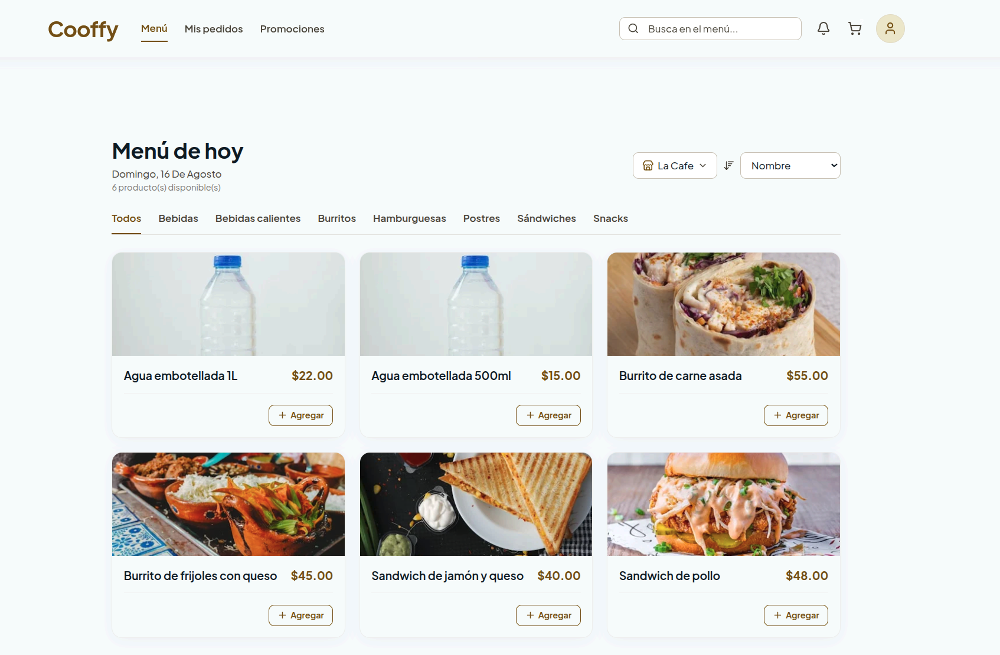
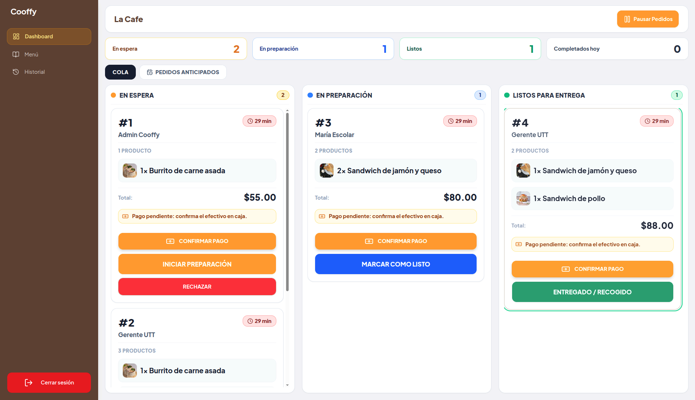
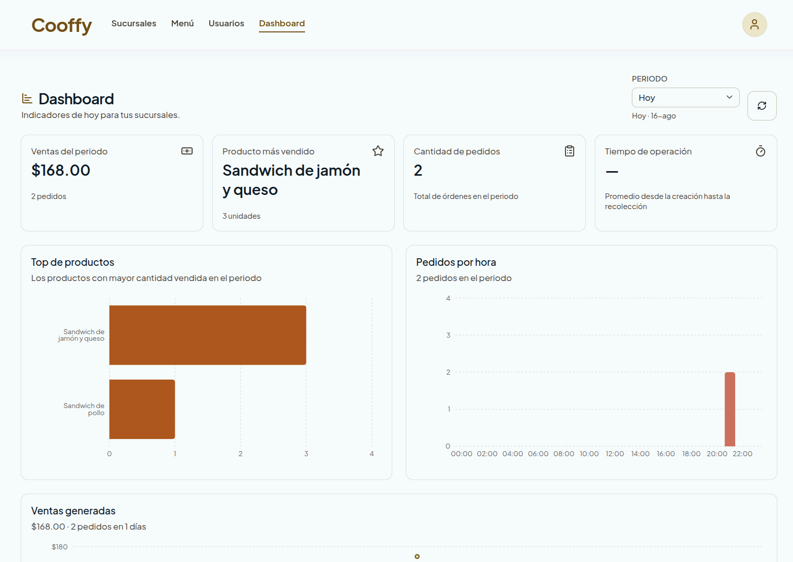
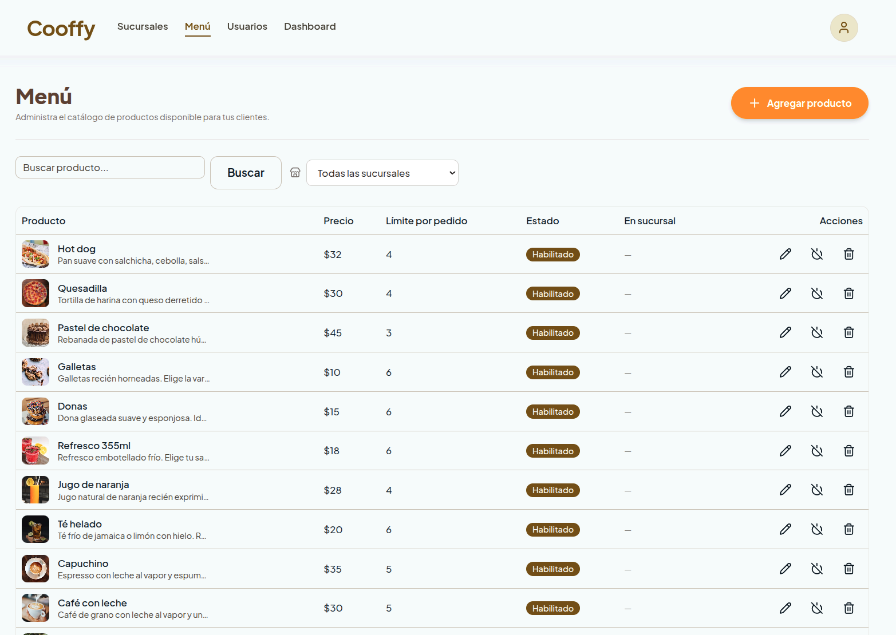
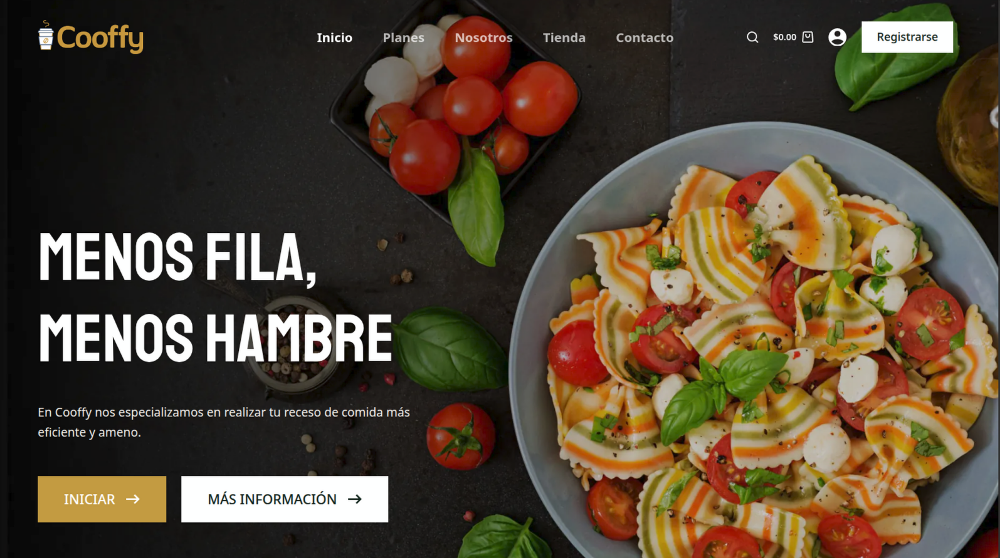

+++
title = "Cooffy"
description = "Sistema gestor de comedores escolares con pedidos anticipados, hecho con Next.js, TypeScript, Django REST y PostgreSQL."
date = "2026-09-17"
lastmod = '2026-09-18'
draft = false
showTableOfContents = false
estado = "activo"
cuatrimestre = ["7vo", "8no"]
autores = ["Genesis Brito", "Andres Cuevas", "Jabes Llamas", "Luis Palomares", "Neyzer Toledo"]
tecnologias = ["react", "python", "django", "docker", "postgresql", "typescript", "nextjs", "tailwind", "wordpress"]
repo = "https://github.com/CooffyUTT/cooffy"
demo = "https://cooffy.neyzt.org/"
tags = ["web", "fullstack", "ci-cd"]
+++



Cooffy es un servicio web que conecta a **estudiantes y personal** con el **área de cocina** de una cafetería escolar. Permite realizar pedidos anticipados antes del receso, eliminando las filas y reduciendo la presión operativa en cocina. El sistema es responsive y accesible desde computadora, tablet o teléfono.

El proyecto se planeó en **7mo cuatrimestre** y desarrolló en el **8vo cuatrimestre** y hoy se conserva como referencia: aunque quedó **abandonado**, su código, su documentación de requerimientos y su arquitectura siguen disponibles para que otra generación lo retome.

## Funcionalidades principales

- **Pedidos anticipados** — el pedido se agenda y entra a cocina el día de la recogida, dentro de una ventana de anticipación configurable por sucursal.
- **Consulta del menú** — platillos con foto, descripción, precio, promociones y disponibilidad.
- **Carrito y pago** — el cliente arma su pedido y elige método de pago (efectivo o tarjeta).
- **Seguimiento de órdenes** — trazabilidad por estados: *En espera → En preparación → Terminado → Entregado*.
- **Disponibilidad de productos** — los productos no disponibles se bloquean para nuevos pedidos; se contempla límite de producción y unidades por pedido.
- **Dashboard administrativo** — indicadores de ventas, pedidos por hora y platillos más vendidos por sucursal.
- **Gestión multi-sucursal** — administración centralizada de sucursales, usuarios y roles.

## Resultados

### Landing page
Aunque lo desarrollamos un poco por separado, se realizó una [landing page](https://cooffy.neyzt.org/) en **WordPress**.

## Stack y arquitectura

Aplicación web responsiva con dos capas desacopladas: el **frontend** en Next.js 16 + React 19 + TypeScript + Tailwind CSS 4 consume una **API REST** en Django 6 + Django REST Framework, con autenticación **JWT** (SimpleJWT) y persistencia en **PostgreSQL 16**. El entorno se levanta con **Docker Compose**, `uv` y `pnpm`.

**Todo fue autohosteado en un servidor casero personal de un integrante del equipo**.

")

> La documentación completa de requerimientos, MVP y arquitectura vive en el repositorio: [CooffyUTT/cooffy](https://github.com/CooffyUTT/cooffy/docs).

## Estado y continuidad

El proyecto quedó **abandonado** debido a cambios en el enfoque del **9no** cuatrimestre, a pesar de que el proyecto tuviera muchas áreas de mejora.
