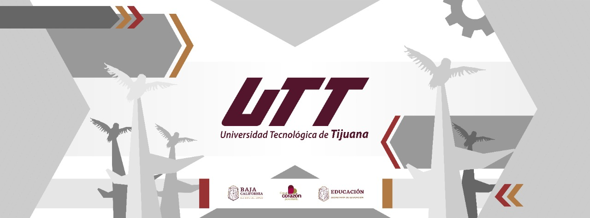

+++
# --- Qué llenar (borra estos comentarios) ---
# title: nombre del proyecto, tal cual se mostrará en el índice
title = "Nombre del proyecto"
# description: 1-2 líneas. MENCIONA el stack aquí, porque el buscador
# del sitio indexa este texto (los campos de metadatos no entran al buscador).
description = "Qué hace el proyecto y con qué (ej. App web para X con PHP y MariaDB)."
date = "2026-09-17"
lastmod = '2026-09-17'
draft = true
showTableOfContents = false
# estado: OBLIGATORIO, sin valor por defecto. Uno de: activo | abandonado | completado
estado = "activo"
# cuatrimestre en que se desarrolló (ej. "8")
cuatrimestre = "8"
# autores: nombres como aparecerán en el índice
autores = ["Jhon Due", "Jane Doe", "Linus Torvalds", "Midu Dev"]
# tecnologías: stack concreto, en minúsculas y consistente (ej. "svelte", "fastapi")
tecnologias = ["php", "mariadb"]
# repo: OBLIGATORIO, enlace al repositorio
repo = "https://github.com/usuario/proyecto"
# demo: opcional, quita la línea si no hay demo o landing page
demo = "https://demo.ejemplo.com"
# tags: opcionales, categorías amplias: AI, web, móvil, PWA…
tags = ["web"]
+++
<!--
# IMAGENES

Para el listado, hay 3 tipos de imagenes. Puede ser cualquier formato, pero deben tener los siguientes nombres :
1. `thumb`: imagen que se verá en el listado y en la tarjeta del proyecto
2. `cover`: imagen que se verá en la página de detalles del proyecto
3. `banner`: imagen que se verá en ambas, tanto en el listado como en la página de detalles. Sirve cuando quieres usar la misma imagen en ambos lados.
4. Cualquier otra imagen pueden simplemente referenciarla mientras describen su proyecto

Estas imagenes son opcionales, pero recomendadas para que sus proyectos se vean mucho mejor.
-->



Descripción breve del proyecto: qué problema resuelve, para quién, y en qué estado está. Es lo que se ve en la tarjeta del índice.

## Subtitulo de prueba
Lorem impsum
 

 
 
 Recuerda que puedes ver el proceso en [esta página →](/agregar-proyecto/)
 
 

<!-- Agregar más información que quieras dar a conocer al proyecto, imagenes, capturas, arquitectura, etc -->
